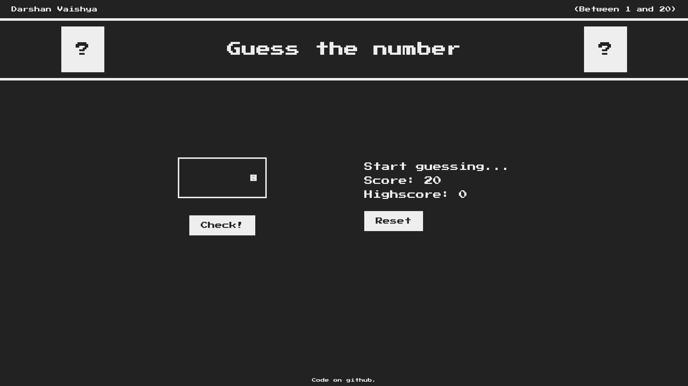
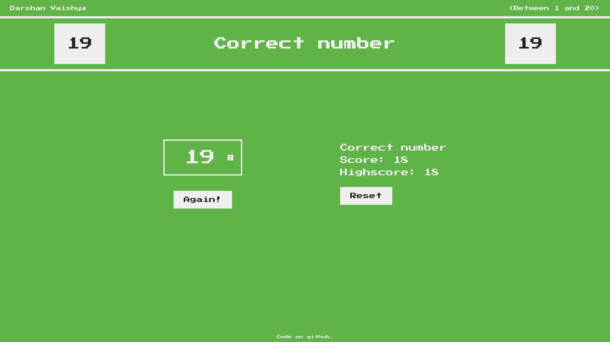

# Guess the number project (16th Dec, 2021)

This project uses HTML, CSS and JS to create a simple game of guessing the number. The highscore system uses local storage to store the data. This allows users to refresh and close the website and still keep their data. It has a retro theme to it.

Live link: [Link](https://gtn.darshanvaishya.xyz/)

## Technologies used

- HTML
- CSS
- Javascript

Created while following the course [The Complete JavaScript Course 2022: From Zero to Expert!](https://www.udemy.com/course/the-complete-javascript-course/) from Udemy.

## Screenshots

Main screen

Guessed the correct number

Game over

